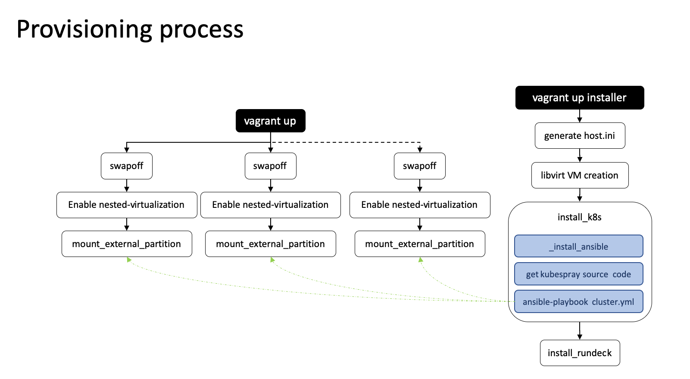

# Kubernetes Reference Deployment

## Summary

This project offers a reference for deploying a Kubernetes cluster.
Its ansible playbooks allow to provision a deployment on Bare-metal
or Virtual Machines.

# Components

| Name           | Description                                   | Source                            | Status      |
|:--------------:|:----------------------------------------------|:----------------------------------|:-----------:|
| Kubernetes     | Base Kubernetes deployment                    | [kubespray][1]                    | Done        |
| ovn-kubernetes | Integrates Opensource Virtual Networking      | [configure-ovn-kubernetes.yml][2] | Tested      |
| Virtlet        | Allows to run VMs                             | [configure-virtlet.yml][3]        | Tested      |
| Multus         | Provides Multiple Network support in a pod    |                                   | Tested      |
| NFD            | Node feature discovery                        | [configure-nfd.yml][4]            | Tested      |
| Istio          | Service Mesh platform                         |                                   | Tested      |

## Deployment

The [installer](installer.sh) bash script contains the minimal
Ubuntu instructions required for running this project.

### Virtual Machines

This project uses [Vagrant tool][5] for provisioning Virtual Machines
automatically. The [setup](setup.sh) bash script contains the
Linux instructions to install dependencies and plugins required for
its usage. This script supports two Virtualization technologies
(Libvirt and VirtualBox).

    $ ./setup.sh -p libvirt

Once Vagrant is installed, it's possible to provision a cluster using
the following instructions:

    $ vagrant up && vagrant up installer

## Day-2 Operations

The functions defined in this project covers the life-cycle of a
Kubernetes cluster. In other words, its possible to add more nodes,
upgrade the existing deployment or remove the services.  The following
instruction shows how to upgrade the existing version to *v1.14.3*:

    $ KRD_KUBE_VERSION=v1.14.3 ./krd_command.sh -a upgrade_k8s

### Environment variables

| Name                  | Default     | Description                                                           |
|:----------------------|:------------|:----------------------------------------------------------------------|
| KRD_DEBUG             | false       | Enables verbose execution                                             |
| KRD_KUBE_VERSION      |             | Specifies the Kubernetes version to be upgraded                       |
| KRD_KUBESPRAY_VERSION |             | Specifies the Kubespray version to be used during the upgrade process |
| KRD_ENABLE_TESTS      |             | Enables the functional tests during the deployment process            |
| KRD_HELM_CHART        |             | Specifies the Helm chart to be installed                              |
| KRD_FOLDER            | /opt/krd    | KRD source code destination folder                                    |
| KRD_ACTIONS           | install_k8s | KRD actions to be installed during the All-in-One execution           |

## License

Apache-2.0

[1]: https://github.com/kubernetes-sigs/kubespray
[2]: playbooks/configure-ovn-kubernetes.yml
[3]: playbooks/configure-virtlet.yml
[4]: playbooks/configure-nfd.yml
[5]: https://www.vagrantup.com/
